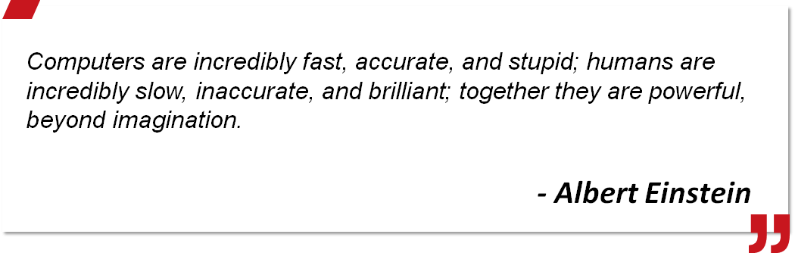
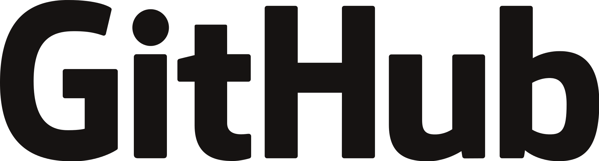
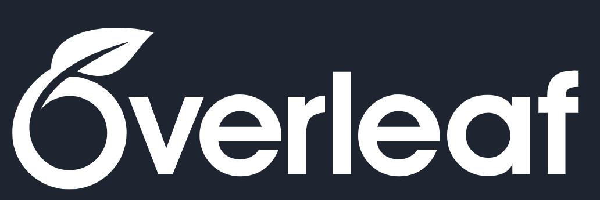
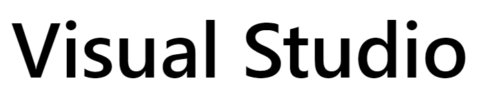
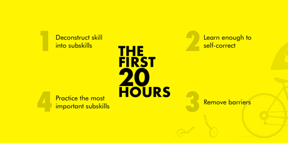
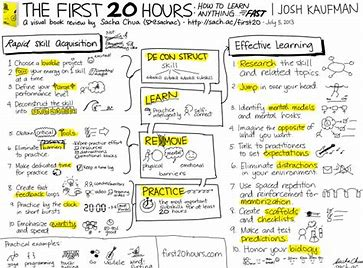
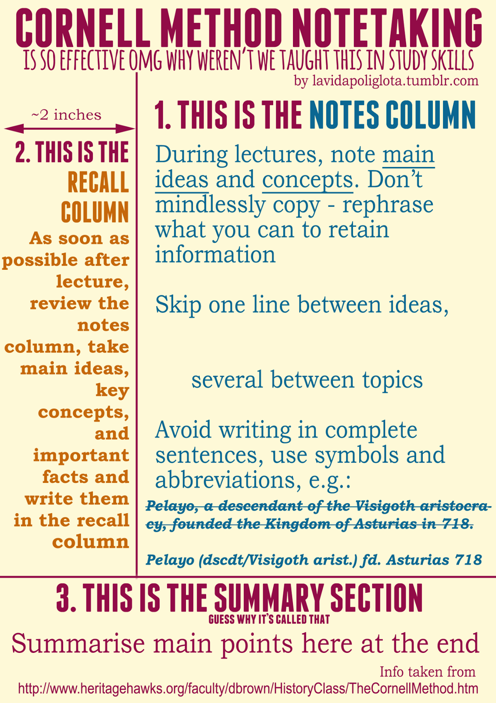

**Computational Physics**    

**Introduction to Course**  

  

Weihua Gu

School of Physics & Astronomy

03-03-2020

---

---

**Outline** 

- Course info
  
- Course description &  objectives 

- Topics

- Grading policy

- Textbook and references

- A quick & effective learner
- Using `JupyterLab`和`Git` (幕布)
- Discussion & self-reflection
---

# Course info

| | |
|--------------|-------|
| Instructor           | Weihu Gu (whgu@sjtu.edu.cn)   |
| TA      | Kun Qian     |
| QQ Group | ID 1048509037     |
| Website |   https://oc.sjtu.edu.cn/courses/18355    |
| Class times  | Tue 10-11:40pm, Thu 8-9:40pm$^1$|
|Zoom  | ID 404058068; PW 07489270

 <small>$1$: starting from the first week, every two weeks </small>

---

# Course description

> *From particle physics and astrophysics to quantum computing and biophysics, calculations on computers have become one of the most indispensable tools of scientists today.*

- Assume no previous computer programming experience.    
  
- The course will introduce the basic ideas and programming skills of computational physics.  

- This is going to be a very hands on course in which students will write their own computer programs. 

---

## What is Computational Physics

Computational Physics:    
***interdisciplinary** subject of natural science overlapping physics, applied mathematics, and computer science.*

  
- focusing on solving physical problems,  

- and on simulating physics world, 
  
- a powerful tool to explore new fields.

---

# Course objectives

After the course, students shall be able to
- gain a basic working knowledge of computational physics techniques,    

- be comfortable with scientific computing in general and prepared to tackle  computational problems in the future, 

- develop solid programming skills,
  
- enhance team-working skills,

- enhance English skills. 

---

# Topics
1. Computational science basics
2. Errors & uncertainties in computations
3. Solving nonlinear equations
4. Solving a system of linear equations
5. Interpolation & data fitting
6. Numerical integration & numerical differentiation
7. Ordinary differential Equation   
   
---
 
8. Fourier analysis
9. Discrete & continuous nonlinear dynamics  
10.  Fractals & statistical growth$^1$ 
11.  Monte Carlo simulation 
12.  PDEs for electrostatics & heat Flow; Schroedinger equation
13. Molecular dynamics simulations$^1$ 
    
<small>1: subject to be adjusted</small>   

---

# Grading policy

| Item | Percentage |  
| :----- | :-------- |
| Homework $\hspace{1cm}$ | 30% |
| Quiz | 10% |
| Midterm exam | 30% |
| Final exam | 30%|

---

## Assignment grading policy

1. Individual/group assignments shall be assigned every Tuesday and
due the following week in class.  
   - make sure that you submit your paper before/in due time.
   - contact with instructor/TA if you know that it will be impossible to turn in an assignment on time.
2. Please submit your homework in **Jupyter Notebook (.ipynb)** format to [Canvas course site](https://oc.sjtu.edu.cn/courses/18355).  You can write either in English or Chinese, English is preferred.  
   
---

3. Make your report succinct and focused on what you did. Don’t bother copying much from the references, but try to use your own words. 

4. No credit will be given for just running a existing code we give you or you find elsewhere; you should be modifying, extending, applying, or rewriting it as part of understanding the problem.

5. You are encouraged to discuss your assignments with other people. If you submit paper, you have agreed that you are prepared to explain it to the instructor.

---

## Teamwork & cloud computing

- Github: https://github.com

- Visual Studio Code Live Share

-  Microsoft Office365: https://office.com
-  Jupyter Notebook online: https://www.kaggle.com
-  VS Code online: https://online.visualstudio.com/
-  Latex online: https://www.overleaf.com/
-  Markdown online: https://dillinger.io/
---

# Textbook and references

-   Rubin H. Landau et al, Computational Physics (3rd Ed.), Wiley-VC, 2015   
-   Nicholas J. Giordano, [Computational Phyics (2nd Ed.)](http://jcbks.lib.sjtu.edu.cn:9088/front/reader/goRead?ssno=10000121&channel=100&jpgread=1), Prentice Hall, 2005    
-  W.H. Press et al, Numerical   Recipes, Cambridge University Press, Cambridge, 1992   
-  Svein Linge, Hans Petter Langtangen, Programming For Computations - Python, Springer, 2018      
-  David Pine, Introduction to Python for Science and Engineering, CRC Press, 2019  
-  刘金远等编著，[计算物理学](http://jcbks.lib.sjtu.edu.cn:9088/front/reader/goRead?ssno=13052939&channel=100&jpgread=1)， 科学出版社，2012   

---

# A quick & effective learner
The first 20 hours:

1. deconstruct skill into subskills

2. learn enough to self-correct
   
3. remove barriers
   
4. practice the most important subskills

---

---

**A successful learning**
- Having **confidence**!
- Asking question, asking the right question.
- Working in group, sharing your experience, teaching others.
- Expressing verbally in complete sentences. 
- Taking time - studying the text, writing programs, debugging and running programs, visualizing the results.

---

**Active search for online help**

- online official documentations
- bing.com, google.com, 
- github.com, [知乎](zhihu.com) 
- B站, [中国大学MOOC](icourse163.org), YouTube
  - [小甲鱼的零基础入门学习Python](https://www.bilibili.com/video/av4050443))
  - **Python 数据分析与展示**, 北京理工大学
- 微信公众号：Datawhale, Python数据科学， 小詹学Python
- $\cdots$
---

---

---

# Using `JupyterLab`和`Git`

[计算物理-工作平台-2019-2020-2（幕布)](https://mubu.com/doc/BsS9OmBK40)

Two sample `Python` scripts and two `JupyterLab` scripts
- `myfirstPython.py`, `myfirstPlot.py`,
- `myfirstJupyterNotebook.ipynb`,   `JupyterLab快捷键指南.ipynb`.
---

<!-- backgroundColor: orange -->
**Discussion & your reflection**

- How are you feeling now? 
- What is your motivation to learn the course? What are your course goals? How to quantify them?
- How to approach your goals? What are your strengths? What is your most challenging obstacle?
- What have your learned today? 
- What is the difference between *computational physics* and *other physics subjects* such as classical mechanics, electromagnetism? 
- Have the various learning methods in common? Will you apply cornell note-taking system? Why yes(no)? 
- Do you have any suggestions for the instructor/TA? 